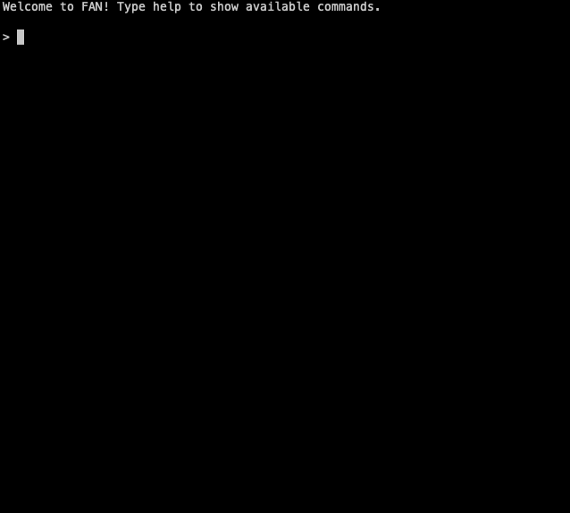

# FAN
Fast Assessment Notes is a simple cli tool to track down your ethical hacking's notes.

## Usage
- `yarn build` to transpile to js bundle.
- `yarn start` to start the tool.

### For developers
`yarn dev` to launch the command in dev mode.

## Todo
- project management
- target management (1 project, many targets)
- add note feature
- table for scanning phase (port, description)
- attach image
- preview phase (pdf)
- preview assessment
- export to md
- export to pdf
- resume feature
